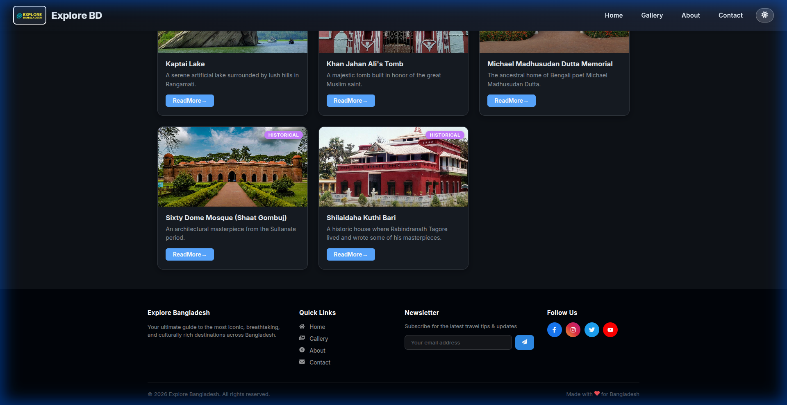
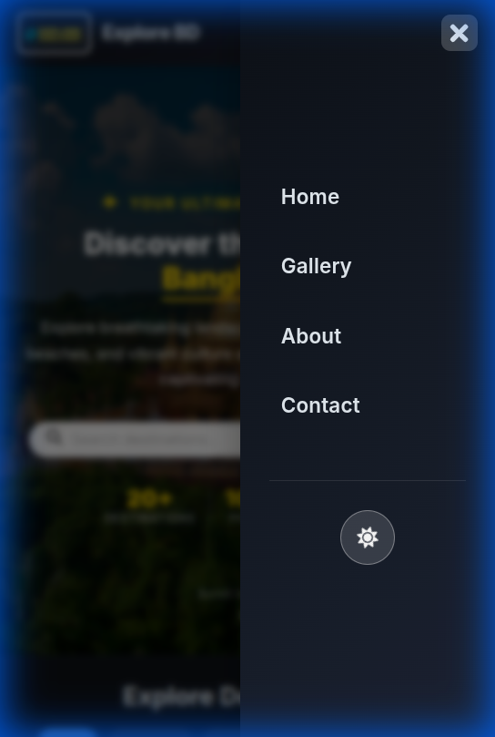

# Explore Bangladesh

A React web application showcasing the most iconic tourist destinations of Bangladesh with detailed blogs and beautiful images.

## Demo

[Live Demo on Vercel](https://explore-bangladesh.vercel.app/)

---

## Project Preview

### Desktop View


### Mobile View (Responsive)


---

## Features

- Responsive grid layout displaying popular tourist spots
- Individual blog pages for each tourist destination
- Image gallery with optimized images
- Navigation with React Router
- Smooth "Read More" buttons with animated text effect
- Google Maps links for location viewing
- Mobile-friendly design

---

## Technologies Used

- React
- React Router DOM
- CSS Grid and Flexbox for layout and styling
- Vercel for deployment

---

## Getting Started

### Prerequisites

- Node.js and npm installed ([Download Node.js](https://nodejs.org/))

### Installation

1. Clone the repository

```bash
git clone https://github.com/<your-github-username>/<your-repo-name>.git
cd <your-repo-name>
