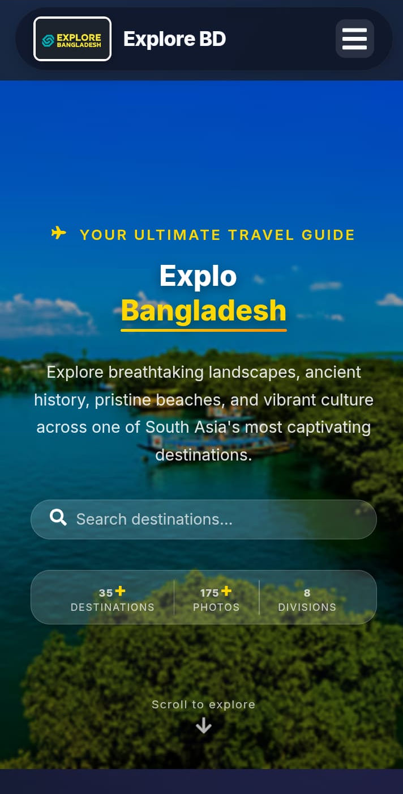
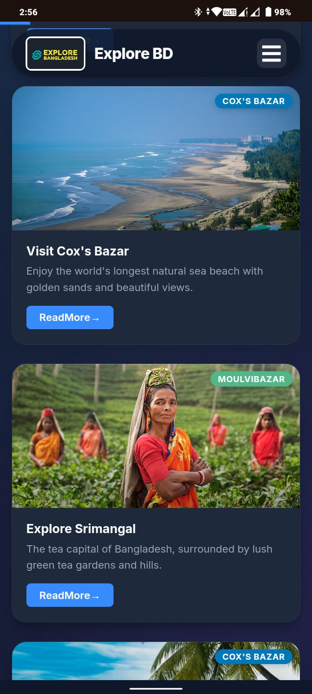

# BanglaGo - The Ultimate Travel Portal

[](https://explore-bangladesh.vercel.app/)
[](https://reactjs.org/)
[](https://vercel.com/)
[](https://opensource.org/licenses/MIT)

## Project Overview
BanglaGo is a modern, high-performance web application built with **React** that showcases the breathtaking tourist destinations of Bangladesh. It provides travelers and explorers with detailed information, high-quality image galleries, and practical navigation tools to discover the hidden gems of the country.

## Tech Stack
- **Frontend Core**: [React.js](https://reactjs.org/) (Hooks & Functional Components)
- **Routing**: [React Router 7](https://reactrouter.com/)
- **Styling**: Tailwind CSS v4, Vanilla CSS (Glassmorphism & Advanced Selectors)
- **Animations**: [Framer Motion](https://www.framer.com/motion/), [React Type Animation](https://www.npmjs.com/package/react-type-animation), [React CountUp](https://www.npmjs.com/package/react-countup)
- **Icons**: [Lucide React](https://lucide.dev/) & [React Icons](https://react-icons.github.io/react-icons/)
- **UI Feedback**: [React Hot Toast](https://react-hot-toast.com/)
- **Image Handling**: [React Slick](https://react-slick.neostack.com/) & Native Vite Glob Imports
- **SEO**: [React Helmet Async](https://github.com/staylor/react-helmet-async)

## Features
- **Premium UI/UX Engine**: Features a custom physics-based Framer Motion glassmorphism cursor, smooth hover reveals, and high-end aesthetic tokens.
- **Dynamic SkyToggle Theme**: Seamless global transition between light and dark themes using React Context and a custom animated day/night toggle.
- **Modern Navigation**: Responsive floating "pill" navbar on desktop and a fixed application-style bottom menu for mobile users.
- **Interactive Shuffle Hero**: A stunning landing page featuring an automatic shuffle grid of 16 top destinations that adapts beautifully to mobile via horizontal scroll.
- **Glassmorphism SpotCards**: Destination cards designed with modern depth, dynamic gradient badges, and backdrop blur effects.
- **Division & District-wise Exploration**: Destinations neatly categorized by 8 Divisions and specific Districts for precise discovery.
- **Scroll-Triggered Animations**: Smooth, cascading entrance animations powered by `framer-motion` as you scroll.
- **Advanced Search**: Filter destinations instantly by Division, District, Title, or Description.
- **Bilingual Cultural Highlights**: Local food and traditional crafts showcased in both English and Bangla.

## Installation
Ensure you have Node.js (v16 or higher) installed.

1. **Clone the repository:**
   ```bash
   git clone https://github.com/rid-coder-70/Explore-Bangladesh-.git
   cd Explore-Bangladesh-
   ```

2. **Install dependencies:**
   ```bash
   npm install
   ```

3. **Start the development server:**
   ```bash
   npm run dev
   ```

4. **Build for production:**
   ```bash
   npm run build
   ```

## API Endpoints
The application uses local JSON files to serve as a fast, robust mockup API for destinations. 
- **Posts Data:** `src/data/posts.json` (Contains all tourist spots, images, descriptions, map links, and nested details).
- **About Data:** `src/data/aboutDestinations.json` (Contains summary destinations for the About Page).


## Screenshots


*(Save the screenshot you captured as `public/hero-screenshot.png` to display it here)*




## Live Demo
Check out the live application hosted on Vercel:
**[BanglaGo Live Demo](https://explore-bangladesh.vercel.app/)**

---

### Project Structure
```text
Explore-Bangladesh/
├── public/                 # Static assets and index.html
├── src/
│   ├── assets/             # Images and design assets
│   ├── components/         # Reusable UI components (Navbar, Footer, etc.)
│   ├── context/            # Context API (DarkModeContext)
│   ├── data/               # Local JSON API data (posts.json, etc.)
│   ├── pages/              # Page components (Home, About, BlogDetail, etc.)
│   ├── utils/              # Helper functions (imageLoader.js)
│   ├── App.jsx             # Main routing and provider wrap
│   ├── index.jsx           # React DOM rendering
│   └── styles.css          # Core CSS variables and global styling
├── vite.config.js          # Vite configuration
├── vercel.json             # Vercel deployment configuration
└── package.json            # Project dependencies and scripts
```

## Contributing
Contributions are welcome! If you'd like to improve the app, please follow these steps:
1. Fork the Project
2. Create your Feature Branch (`git checkout -b feature/AmazingFeature`)
3. Commit your Changes (`git commit -m 'Add some AmazingFeature'`)
4. Push to the Branch (`git push origin feature/AmazingFeature`)
5. Open a Pull Request

## Contact
**RidCoder** - [GitHub](https://github.com/rid-coder-70)

Project Link: [https://github.com/rid-coder-70/Explore-Bangladesh-](https://github.com/rid-coder-70/Explore-Bangladesh-)

---

*Made with ❤️ for Bangladesh*
